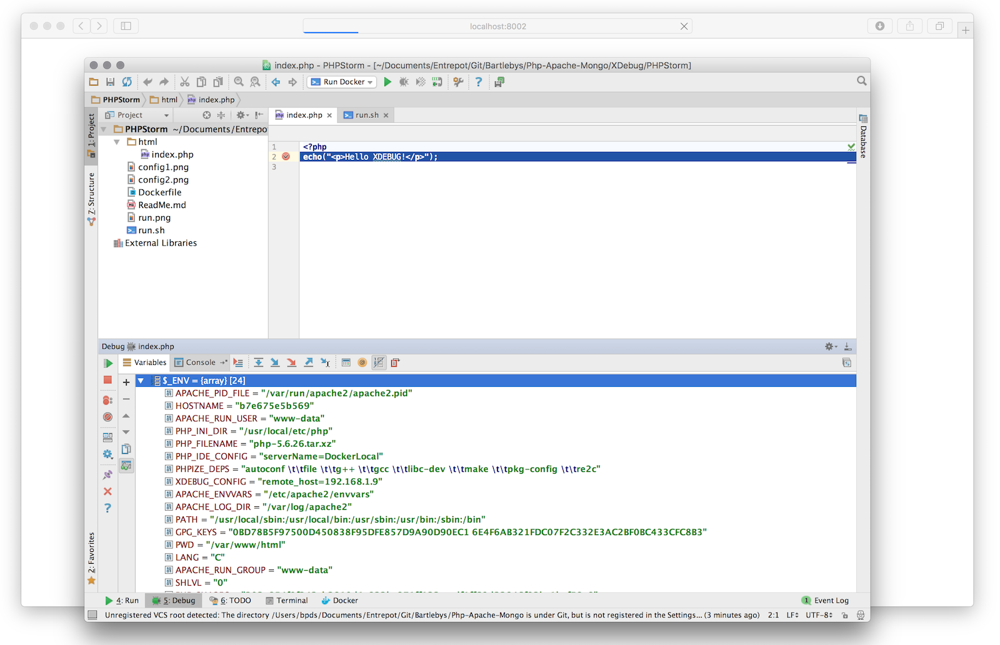
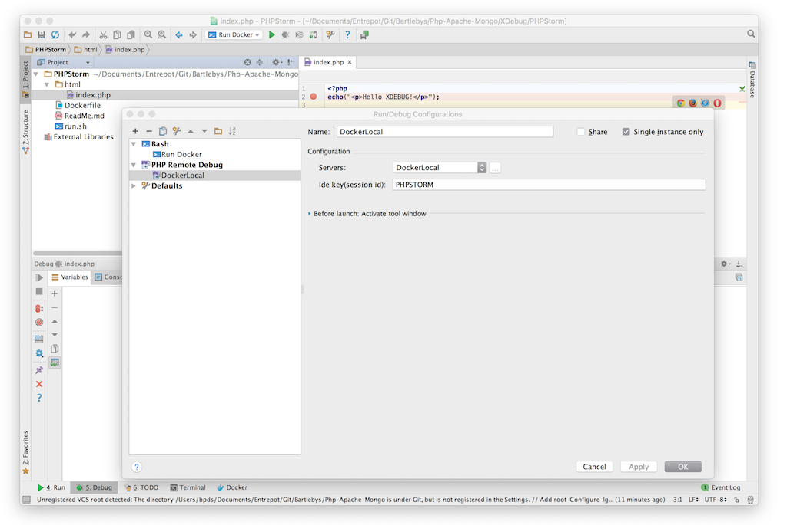
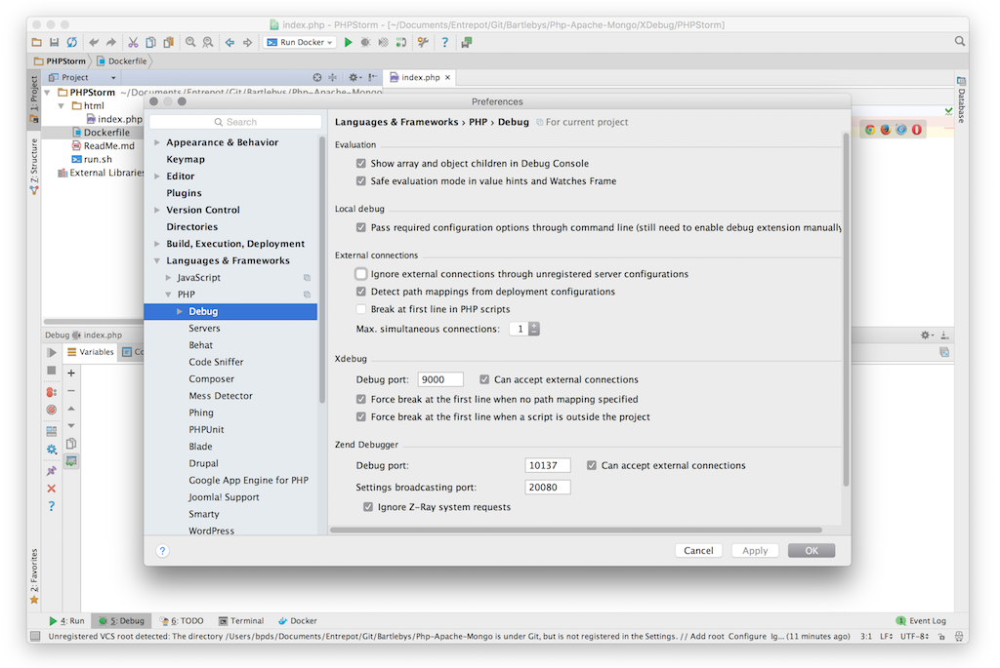

# Php-Apache-Mongo (with Dockerized XDebug support)

This Docker image is based on the Official `php-apache` image.
It offers a *Zero Config* fully *dockerized* development environment for macOS.
You just call one install script and you obtain a fully dockerized running PHP Development stack.

Feel free to contribute and [propose improvements](https://github.com/Bartlebys/Php-Apache-Mongo/issues).

## Featuring 

- PHP 5.6 (7.X to come soon) 
- MongoDB 
- Apache 
- Xdebug

# Includes a Fully functional PHPStorm Sample project


[XDebug/PHPStorm](XDebug/PHPStorm/)




# How to install the PHPStorm sample?

Prerequisite: Download and install [docker for mac](https://download.docker.com/mac/stable/Docker.dmg)

1. Move to [XDebug/PHPStorm](XDebug/PHPStorm/)
2. Open your IDE and listen to XDebug.
3. run `./install.sh'
4. After building the image (may take a few minutes) and running the container it should open a browser on http://localhost:8002/
You will have a full PHP / APACHE / MONGODB container with XDEBUG enabled.


**You can run again with updated source by calling `./run.sh`**





# Sequence 

- Pull the base image `docker pull bartlebys/php-apache-mongo`
- Build the  image `docker build -t dockerizedsampleimage:latest .`
- Run the container 

```
# Grab the Host IP
HOST_IP=$(ifconfig en0 | grep inet | grep -v inet6 | awk '{print $2}')

docker run  -e PHP_IDE_CONFIG="serverName=DockerLocal"\
            -e XDEBUG_CONFIG="idekey=PHPSTORM"\
            -e XDEBUG_CONFIG="remote_host=$HOST_IP"\
            -p 27017:27017 \
            -p 8002:80\
            -d --name DockerizedSample dockerizedsampleimage
```


# Validated with

+ PhpStorm 2016.2.1
+ Build #PS-162.1889.1, built on August 23, 2016
+ You have perpetual fallback license for this version
+ JRE: 1.8.0_76-release-b216 x86_64
+ JVM: OpenJDK 64-Bit Server VM by JetBrains s.r.o
+ macOS Sierra **10.12 (16A323)**
+ Docker for mac Installed from the official [docker for mac](https://download.docker.com/mac/stable/Docker.dmg) **Version 1.12.1** (build: 12133) 2d5b4d9c3daa089e3869e6355a47dd96dbf39856
